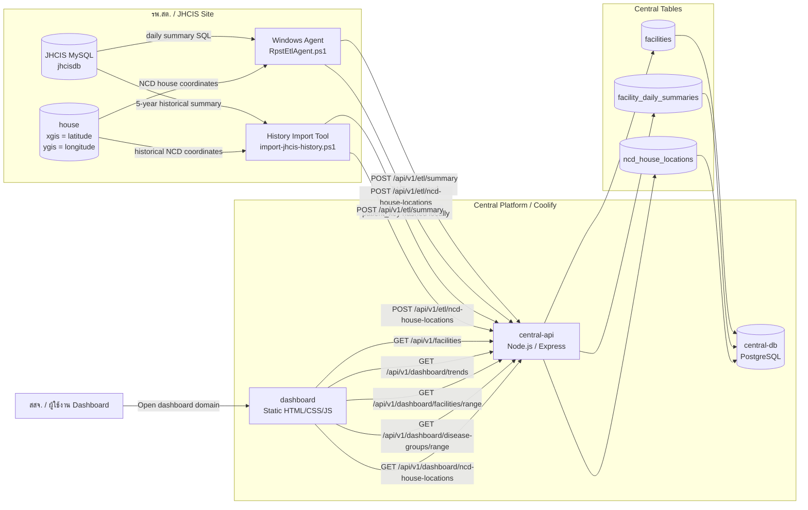
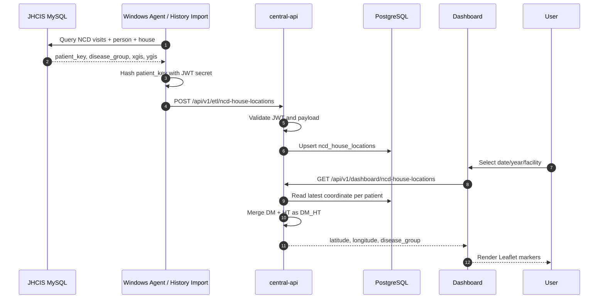
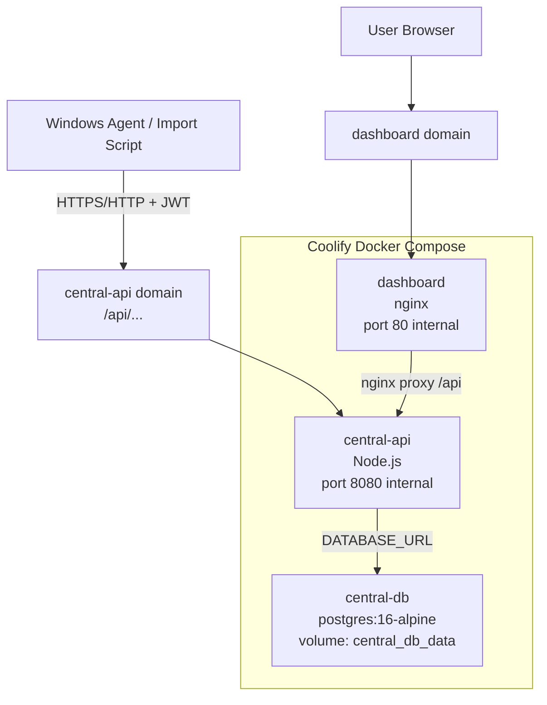
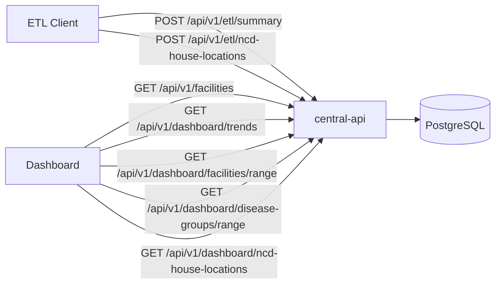

# RPST Data Warehouse Architecture

```mermaid
flowchart LR
  subgraph Facility["รพ.สต. / JHCIS Site"]
    JHCIS[("JHCIS MySQL\njhcisdb")]
    House[("house\nxgis = latitude\nygis = longitude")]
    WinAgent["Windows Agent\nRpstEtlAgent.ps1"]
    HistoryImport["History Import Tool\nimport-jhcis-history.ps1"]
  end

  subgraph Central["Central Platform / Coolify"]
    API["central-api\nNode.js / Express"]
    DB[("central-db\nPostgreSQL")]
    Dashboard["dashboard\nStatic HTML/CSS/JS"]
  end

  subgraph Tables["Central Tables"]
    Facilities[("facilities")]
    Daily[("facility_daily_summaries")]
    Locations[("ncd_house_locations")]
  end

  User["สสจ. / ผู้ใช้งาน Dashboard"]

  JHCIS -->|daily summary SQL| WinAgent
  House -->|NCD house coordinates| WinAgent
  JHCIS -->|5-year historical summary| HistoryImport
  House -->|historical NCD coordinates| HistoryImport

  WinAgent -->|POST /api/v1/etl/summary\nJWT protected| API
  WinAgent -->|POST /api/v1/etl/ncd-house-locations\npatient_key hashed locally| API

  HistoryImport -->|POST /api/v1/etl/summary| API
  HistoryImport -->|POST /api/v1/etl/ncd-house-locations| API

  API --> Facilities
  API --> Daily
  API --> Locations
  Facilities --> DB
  Daily --> DB
  Locations --> DB

  Dashboard -->|GET /api/v1/facilities| API
  Dashboard -->|GET /api/v1/dashboard/trends| API
  Dashboard -->|GET /api/v1/dashboard/facilities/range| API
  Dashboard -->|GET /api/v1/dashboard/disease-groups/range| API
  Dashboard -->|GET /api/v1/dashboard/ncd-house-locations| API

  User -->|Open dashboard domain| Dashboard
```

## NCD Map Data Flow

```mermaid
sequenceDiagram
  autonumber
  participant J as JHCIS MySQL
  participant A as Windows Agent / History Import
  participant C as central-api
  participant P as PostgreSQL
  participant D as Dashboard
  participant U as User

  A->>J: Query NCD visits + person + house
  J-->>A: patient_key, disease_group, xgis, ygis
  A->>A: Hash patient_key with JWT secret
  A->>C: POST /api/v1/etl/ncd-house-locations
  C->>C: Validate JWT and payload
  C->>P: Upsert ncd_house_locations
  U->>D: Select date/year/facility
  D->>C: GET /api/v1/dashboard/ncd-house-locations
  C->>P: Read latest coordinate per patient
  C->>C: Merge DM + HT as DM_HT
  C-->>D: latitude, longitude, disease_group
  D-->>U: Render Leaflet markers
```

## Deployment View

```mermaid
flowchart TB
  subgraph Coolify["Coolify Docker Compose"]
    CentralDb["central-db\npostgres:16-alpine\nvolume: central_db_data"]
    CentralApi["central-api\nNode.js\nport 8080 internal"]
    Web["dashboard\nnginx\nport 80 internal"]
  end

  PublicApi["central-api domain\n/api/..."]
  PublicDashboard["dashboard domain"]
  Agent["Windows Agent / Import Script"]
  Browser["User Browser"]

  Agent -->|HTTPS/HTTP + JWT| PublicApi
  PublicApi --> CentralApi
  CentralApi -->|DATABASE_URL| CentralDb
  Browser --> PublicDashboard
  PublicDashboard --> Web
  Web -->|nginx proxy /api| CentralApi
```

## Main API Endpoints

```mermaid
flowchart LR
  Client["ETL Client"]
  Dashboard["Dashboard"]
  API["central-api"]
  DB[("PostgreSQL")]

  Client -->|"POST /api/v1/etl/summary"| API
  Client -->|"POST /api/v1/etl/ncd-house-locations"| API

  Dashboard -->|"GET /api/v1/facilities"| API
  Dashboard -->|"GET /api/v1/dashboard/trends"| API
  Dashboard -->|"GET /api/v1/dashboard/facilities/range"| API
  Dashboard -->|"GET /api/v1/dashboard/disease-groups/range"| API
  Dashboard -->|"GET /api/v1/dashboard/ncd-house-locations"| API

  API --> DB
```

