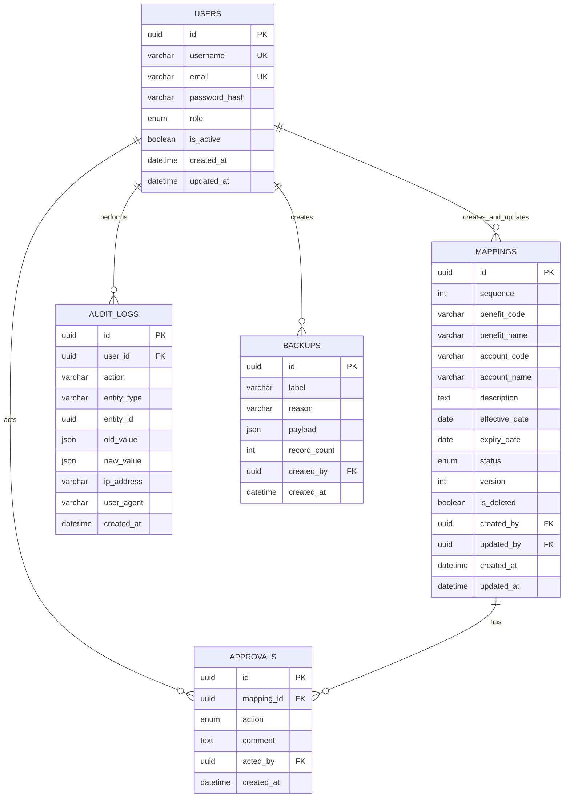

# UB-AMMS ER Diagram

Business key ของ Mapping คือ `(benefit_code, account_code, effective_date)` และใช้ `version`
สำหรับ optimistic concurrency control เพื่อป้องกันผู้ใช้เขียนทับข้อมูลกันโดยไม่ตั้งใจ
